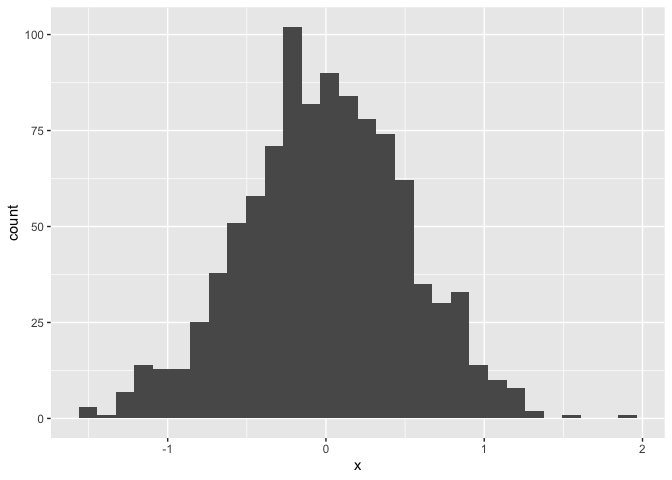
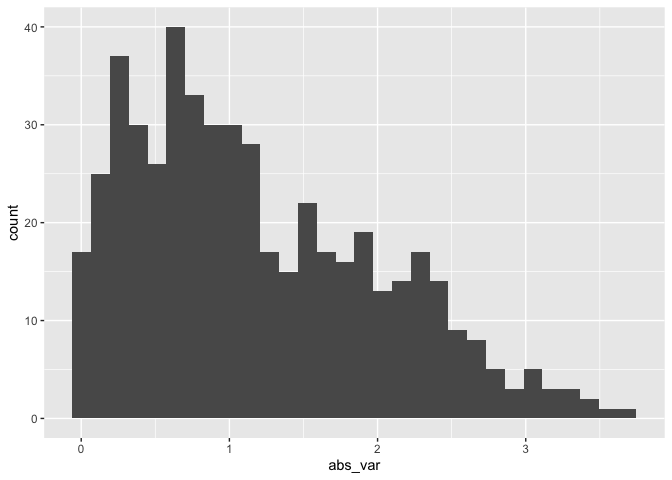

Intro to R Markdown / GitHub Lecture
================
Lauren Littig

I’m an R Markdown document!

# Section 0: libraries and notes

- echo = F hides code chunks
- message = F hides addnl messages/suggestions
- eval = F makes code chunk not run
- TOC gives table of contents

``` r
library(tidyverse)
```

    ## ── Attaching core tidyverse packages ──────────────────────── tidyverse 2.0.0 ──
    ## ✔ dplyr     1.2.1     ✔ readr     2.2.0
    ## ✔ forcats   1.0.1     ✔ stringr   1.6.0
    ## ✔ ggplot2   4.0.3     ✔ tibble    3.3.1
    ## ✔ lubridate 1.9.5     ✔ tidyr     1.3.2
    ## ✔ purrr     1.2.2     
    ## ── Conflicts ────────────────────────────────────────── tidyverse_conflicts() ──
    ## ✖ dplyr::filter() masks stats::filter()
    ## ✖ dplyr::lag()    masks stats::lag()
    ## ℹ Use the conflicted package (<http://conflicted.r-lib.org/>) to force all conflicts to become errors

# Section 1

Here’s a **code chunk** that samples from a *normal distribution*:

``` r
samp = rnorm(100) # this samples from a normal distribution
length(samp)
```

    ## [1] 100

# Section 2

I can take the mean of the sample, too! The mean is -0.0510414.

# Section 3: a tibble

This plot shows the distribution of the absolute value of $X$

<!-- -->

    ## # A tibble: 6 × 2
    ##         x      y
    ##     <dbl>  <dbl>
    ## 1 -0.313   1.51 
    ## 2  0.0918  2.30 
    ## 3 -0.418  -0.706
    ## 4  0.798   2.81 
    ## 5  0.165   1.40 
    ## 6 -0.410  -1.48

# Section 5: Learning Assessment 2

Write a named code chunk that creates a dataframe comprised of: a
numeric variable containing a random sample of size 500 from a normal
variable with mean 1; a logical vector indicating whether each sampled
value is greater than zero; and a numeric vector containing the absolute
value of each element. Then, produce a histogram of the absolute value
variable just created. Add an inline summary giving the median value
rounded to two decimal places. What happens if you set eval = FALSE to
the code chunk? What about echo = FALSE?

``` r
la_df = tibble(
  num_var = rnorm(n = 500, mean = 1),
  log_var = num_var > 0,
  abs_var = abs(num_var))

ggplot(la_df, aes(x = abs_var)) + geom_histogram()
```

    ## `stat_bin()` using `bins = 30`. Pick better value `binwidth`.

<!-- -->
The median is 1.02

The median is 1.02

Second way is preferable for reasons I dont get. Something about
changing the dataset.

# Section 6: Formatting

Text formatting \_\_\_\_\_\_\_\_\_\_\_\_\_\_\_\_\_\_\_\_\_

*italic* or *italic* **bold** or **bold** `num_var` superscript^2 and
subscript<sub>2</sub>

Headings \_\_\_\_\_\_\_\_\_\_\_\_\_\_\_\_\_\_\_\_\_

# 1st Level Header

## 2nd Level Header

### 3rd Level Header

## Lists

- Bulleted
- Item 1a

1.  Numbered list item 1
2.  Item 2. Apparantly this wil be \#2 when knitting (shows 1 in
    RStudio)

## Tables

| First Header | Second Header |
|--------------|---------------|
| Content Cell | Content Cell  |
| Content Cell | Content Cell  |

# Section 7: Learning Assessment 3

After the previous code chunk, write a bullet list given the mean,
median, and standard deviation of the original random sample.

- The mean is 1.0090958
- The median is 0.9517781
- The SD is 1.0373553
